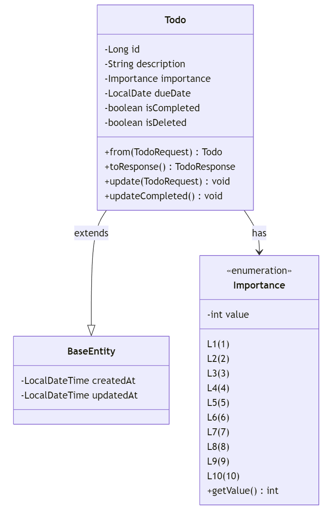

# 일정 관리 웹 애플리케이션

## 프로젝트 소개

캘린더와 ToDo List를 결합한 일정관리 웹 애플리케이션입니다. 캘린더에서 특정 날짜를 선택하고 해당 날짜에 일정을 작성할 수 있으며, 작성된 일정을 Excel이나 PDF 형식으로 내보낼 수 있습니다.

## Frontend (React.js)

### 기술 스택

- React.js v18
- Styled-components
- Context API

### 설치 및 실행 방법

#### 필요 환경

- Node.js (최신 LTS 버전)
- yarn 또는 npm 패키지 매니저

#### 실행 단계

```bash
# 1. 프로젝트 클론
git clone https://github.com/ssuwwann/clush.git

# 2. 프로젝트 디렉토리로 이동
cd [project directory/clush/front]

# 3. 의존성 설치
yarn install || npm install

# 4. 개발 서버 실행
yarn dev || npm run dev
```

개발 서버는 http://localhost:5173 에서 실행됩니다.

### 주요 컴포넌트 및 기술 설명

#### Context API를 활용한 상태 관리

**DateContext**

- 선택된 날짜 상태의 전역 관리
- 캘린더-할일 목록 간 날짜 동기화
- 날짜 형식 변환 로직 중앙화

**TodoContext**

- 할일 목록 데이터 상태 관리
- 페이지네이션 처리
- 데이터 fetch 로직 캡슐화

**선택 이유**

- Props Drilling 방지
- 간단한 상태 관리 구현
- 효율적인 코드 구조화

## Backend (Spring Boot)

### 기술 스택

- Java 21
- Spring Boot 3
- MySQL 8.0
- Gradle
- JPA
- Apache POI
- OpenPDF
- Swagger (API 문서화)

### 설치 및 실행 방법

#### 필요 환경

- JDK 21 이상
- MySQL 8.0 이상
- Gradle 7.6 이상

#### MySQL 설정 및 실행 방법

1. MySQL 서버 실행 확인
2. src/main/resources 디렉토리에 application-local.yml 파일 생성

#### 초기 DB/계정 생성을 위한 root 설정

```yml
mysql:
  url: jdbc:mysql://localhost:3306/clush
  username: root
  password: [ 비밀번호 ]

spring:
  datasource:
    driver-class-name: com.mysql.cj.jdbc.Driver
    url: jdbc:mysql://localhost:3306/clush
    username: clush
    password: clush
```

#### 프로젝트 실행 방법

```bash
# 1. 프로젝트 클론
git clone https://github.com/ssuwwann/clush.git

# 2. 프로젝트 디렉토리로 이동
cd [project directory/clush/back]

# 3. 프로젝트 빌드
cd [project directory/clush/back]
./gradlew build

# 4. 애플리케이션 실행
java -jar build/libs/back-0.0.1-SNAPSHOT.jar
```

주의: DatabaseInitializer가 mysql 설정으로 DB와 사용자 계정을 자동 생성합니다. Spring Boot의 datasource 설정도 필요하며, 두 설정이 모두 있어야 애플리케이션이 실행됩니다.

### 주요 라이브러리

#### Apache POI (v5.2.3)

Excel 파일 생성을 위한 Java 라이브러리

**선택 이유**

- Excel 문서 처리 기능 제공
- 대규모 데이터 처리에도 안정적인 성능
- 다양한 스타일링 옵션으로 깔끔한 문서 생성 가능

**주요 기능**

- XSSFWorkbook: 최신 Excel 형식(.xlsx) 문서 생성
- 자동 열 너비 조정 및 셀 스타일링
- 한글 처리 지원

#### OpenPDF (v1.3.30)

PDF 문서 생성을 위한 라이브러리

**선택 이유**

- iText의 오픈소스 포크 버전으로 라이선스 이슈 없음
- 가볍고 사용하기 쉬운 API 제공
- 한글 폰트 및 유니코드 처리 우수

**주요 기능**

- 커스텀 폰트 적용 (메이플스토리체 사용)
- 테이블 레이아웃 및 스타일링
- 문서 정렬 및 여백 설정

### API 명세

Swagger UI 주소: http://localhost:8080/swagger-ui/index.html

**제공 API:**

- 일정 CRUD API
- 일정 내보내기 API (Excel/PDF)
- 일정 검색 및 필터링 API

### 테스트 케이스

```bash
# 전체 테스트 실행
cd [project directory/clush/back]
gradlew test
```

**구현된 테스트:**

- Controller Layer Tests (API 엔드포인트, 요청/응답 데이터 검증)
- Service Layer Tests (비즈니스 로직, 내보내기 기능)
- Repository Layer Tests (데이터 저장/조회, JPA 쿼리)

### 데이터베이스 스키마



```sql
CREATE TABLE todos
(
    id          BIGINT PRIMARY KEY AUTO_INCREMENT,
    description VARCHAR(255) NOT NULL,
    due_date    DATE         NOT NULL,
    importance  INT          NOT NULL,
    completed   BOOLEAN   DEFAULT FALSE,
    created_at  TIMESTAMP DEFAULT CURRENT_TIMESTAMP,
    updated_at  TIMESTAMP DEFAULT CURRENT_TIMESTAMP ON UPDATE CURRENT_TIMESTAMP
);

-- 인덱스
CREATE INDEX idx_due_date ON todos (due_date);
CREATE INDEX idx_completed ON todos (completed);
```
